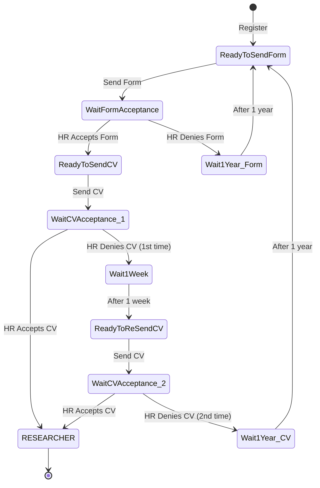

# 🔬 Researcher Metadata Management System

> 🇹🇷 Türkçe için: [README.tr.md](README.tr.md)

A backend system for a company that hires researchers. Candidates apply through a multi-stage job application, HR reviews them, and accepted candidates become researchers whose **metadata** (citation count, publication count, degree, etc.) is stored, edited, and periodically refreshed from an external academic API.

> In short: a role-based hiring + metadata platform built around two hard problems — a **multi-stage application flow modeled as a state machine**, and a **flexible metadata model** where the set of metadata fields isn't fixed in advance.

---

## 🚀 Tech Stack

- **Framework:** Spring Boot (Java 19)
- **Database:** PostgreSQL + Spring Data JPA
- **Auth:** Spring Security + JWT, role-based access
- **Testing:** JUnit + Testcontainers (E2E / integration tests against a real database)
- **DevOps:** Docker, GitLab CI/CD (build → test → deploy), AWS EC2
- **Docs:** OpenAPI / Swagger

---

## 👥 Roles

- **Job Applicant** — registers, submits a form and CV, tracks application status
- **HR Specialist** — reviews applications, accepts/rejects with a reason
- **Researcher** — a hired applicant; owns metadata, can view their own
- **Editor** — defines metadata types and edits researchers' metadata
- **Admin** — read-only visibility over all users and their metadata

---

## 🧠 Quick Explanation (Non-Technical)

A person applies for a researcher position. They fill in a form; HR accepts or rejects it. If accepted, they send a CV; HR reviews that too. Only after both stages pass does the applicant officially become a researcher. Rejections come with a cooldown — you can't immediately spam new applications. Once someone is a researcher, the system keeps their academic metadata up to date by periodically pulling it from an external source.

---

## ⚡ Hard Parts & Engineering Solutions

### 1) Multi-Stage Application Flow (State Machine)

**Problem:** A job application isn't a single yes/no. It moves through form submission, HR form review, CV submission, HR CV review — each with accept/reject branches, and rejections impose waiting periods before re-applying. Hard-coding this with scattered `if` checks and a flag per state gets fragile fast.

**Solution:** The application lifecycle is modeled as a **finite state machine (DFA)**. Each state and the allowed transitions between them are explicit, so an applicant can only move along valid paths (e.g. you can't send a CV before your form is accepted), and the cooldown states are first-class rather than ad-hoc checks.



> Rejection penalties escalate: a form rejection, or a **second** CV rejection, sends the applicant back to the very start (form) with a **1-year** cooldown, while a **first** CV rejection only costs a **1-week** cooldown and lets them resend the CV. The waiting durations are configurable rather than hard-coded, so the policy can change without touching the flow logic.

### 2) Flexible Metadata Model

**Problem:** Researchers don't have a fixed set of attributes. One might have a citation count, another a degree level, another something that doesn't exist yet. Adding a database column per attribute doesn't scale and means a schema change every time a new metadata type appears.

**Solution:** Metadata is **data-driven, not schema-driven**, using two tables:

- **`metadata_registry`** → defines a metadata *type* (name + value type, e.g. `citation_count : positive_int`, `degree : enum`)
- **`metadata_value`** → a single researcher's value for one registry entry

A researcher can hold any combination of metadata values, and a `(user_id, metadata_registry_id)` uniqueness rule means one value per type per researcher. New metadata types are added as **rows, not columns** — no schema migration needed. Type validation (e.g. "this must be a positive int") is enforced in the backend.

### 3) Decoupling from a Changing External API

**Problem:** Researcher metadata is refreshed from an external academic API (e.g. Web of Science), but that API can change — its request shape, its response shape, or the provider entirely. If that change ripples through the whole codebase, every integration is fragile.

**Solution:** The integration is **modular and isolated**. The logic that *calls and parses* the external API is kept separate from the logic that *updates metadata*. A scheduled job periodically fetches data per researcher and maps it into `metadata_value` records (insert if missing, update if present). The "update metadata" step is independent of the API, so swapping or changing the provider touches only the integration layer — the core update logic stays the same.

### 4) Secure File Upload / Download

**Problem:** CVs are uploaded files. Storing them naively (original name, served through the app) creates collisions, leaks the storage layout, and ties up application resources.

**Solution:** Uploaded files are split into **physical file** and **file metadata**:

- The file is stored on disk under a **generated UUID name** inside a date-based folder (e.g. `cdn/2024/06/30/`), not its original name.
- A `FileInfo` record (its own separate id) keeps the original name, size, and location.
- The API response exposes the original name and size but **never the real storage path**.

On download, the original name and contents are restored. File upload is kept isolated (the upload endpoint only uploads), so a file can later be associated with a context like a CV separately.

---

## 🧪 Testing

The project is built test-first, with **E2E / integration tests** running against a **real PostgreSQL instance via Testcontainers** — covering registration, login, role-based access (e.g. only Admin can list all users), and the file upload/download cycle. Both positive and negative cases are tested (valid requests succeed; invalid email, duplicate email, wrong password, and unauthorized access all fail with the right status and message).

---

## 🛠️ DevOps

A GitLab CI/CD pipeline runs in three stages:

1. **Build** — compile and build a Docker image
2. **Test** — run the test suite on GitLab runners
3. **Deploy** — render a `docker-compose.yml` from a template (via `envsubst`), ship it to the remote machine over SSH, and run the container

The app is containerized with Docker and deployed to an AWS EC2 instance.

---

## 🛠️ Local Setup

```bash
mvn clean package
mvn spring-boot:run
```

Configure the database connection and external API settings via environment variables / `application.yml` before running.
