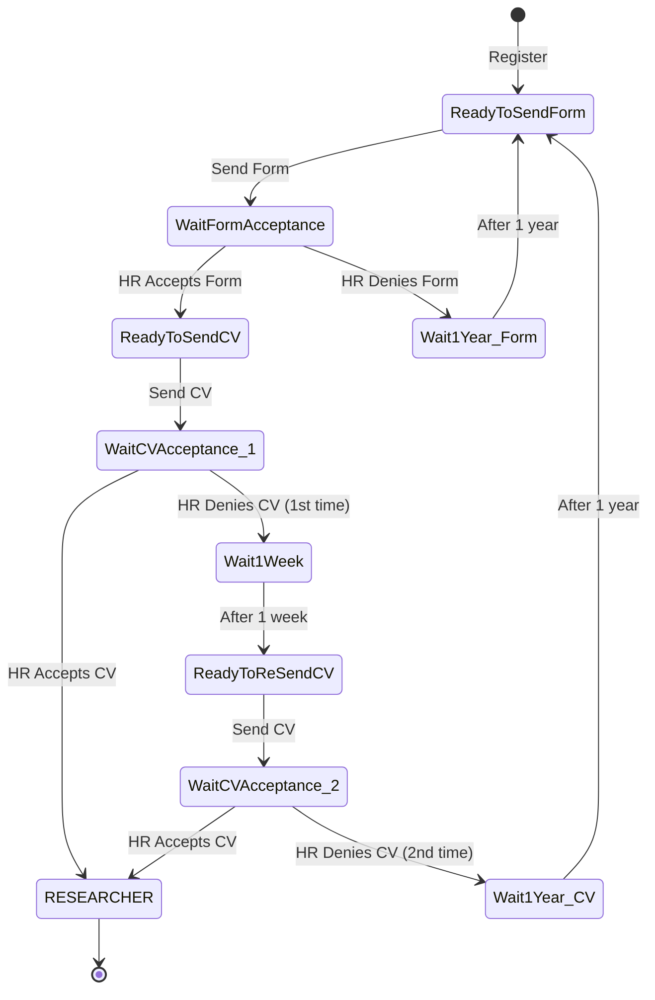

# 🔬 Researcher Metadata Management System

> 🇬🇧 For English: [README.md](README.md)

Araştırmacı işe alan bir şirket için geliştirilmiş bir backend sistemi. Adaylar çok aşamalı bir iş başvurusuyla başvurur, HR değerlendirir, kabul edilen adaylar araştırmacıya dönüşür ve araştırmacıların **metadata**'sı (atıf sayısı, yayın sayısı, derece vb.) saklanır, düzenlenir ve harici bir akademik API'den periyodik olarak güncellenir.

> Kısaca: iki zorlu problem üzerine kurulu, rol bazlı bir işe alım + metadata platformu — **state machine olarak modellenen çok aşamalı bir başvuru akışı** ve metadata alanlarının önceden sabit olmadığı **esnek bir metadata modeli**.

---

## 🚀 Teknoloji

- **Framework:** Spring Boot (Java 19)
- **Veritabanı:** PostgreSQL + Spring Data JPA
- **Auth:** Spring Security + JWT, rol bazlı erişim
- **Test:** JUnit + Testcontainers (gerçek bir veritabanına karşı E2E / entegrasyon testleri)
- **DevOps:** Docker, GitLab CI/CD (build → test → deploy), AWS EC2
- **Dokümantasyon:** OpenAPI / Swagger

---

## 👥 Roller

- **Job Applicant** — kayıt olur, form ve CV gönderir, başvuru durumunu takip eder
- **HR Specialist** — başvuruları değerlendirir, gerekçeyle kabul/red eder
- **Researcher** — işe alınmış aday; metadata'ya sahiptir, kendininkini görebilir
- **Editor** — metadata tiplerini tanımlar ve araştırmacıların metadata'sını düzenler
- **Admin** — tüm kullanıcılar ve metadata üzerinde salt-okunur görünürlük

---

## 🧠 Nasıl Çalışır? (Kısa Açıklama)

Bir kişi araştırmacı pozisyonuna başvurur. Bir form doldurur; HR kabul ya da reddeder. Kabul edilirse bir CV gönderir; HR onu da değerlendirir. Yalnızca iki aşama da geçildikten sonra aday resmen araştırmacı olur. Redler bir bekleme süresiyle gelir — hemen arka arkaya başvuru yapılamaz. Bir kişi araştırmacı olduğunda, sistem akademik metadata'sını harici bir kaynaktan periyodik olarak çekerek güncel tutar.

---

## ⚡ Zor Kısımlar ve Mühendislik Çözümleri

### 1) Çok Aşamalı Başvuru Akışı (State Machine)

**Problem:** Bir iş başvurusu tek bir evet/hayır değildir. Form gönderimi, HR form değerlendirmesi, CV gönderimi, HR CV değerlendirmesi aşamalarından geçer — her biri kabul/red dallarıyla, ve redler yeniden başvurmadan önce bekleme süreleri dayatır. Bunu dağınık `if` kontrolleri ve her durum için bir flag ile kodlamak hızla kırılgan hale gelir.

**Çözüm:** Başvuru yaşam döngüsü bir **sonlu durum makinesi (DFA)** olarak modellendi. Her durum ve aralarındaki izinli geçişler açıkça tanımlı; böylece bir aday yalnızca geçerli yollarda ilerleyebilir (örn. formun kabul edilmeden CV gönderemezsin) ve bekleme durumları ad-hoc kontroller değil, birinci sınıf durumlar.



> Red cezaları kademeli: form reddi ya da **ikinci** CV reddi, adayı **1 yıl** bekleme süresiyle en başa (form) geri gönderir; **ilk** CV reddi ise yalnızca **1 hafta** bekleme süresiyle CV'yi yeniden göndermeye izin verir. Bekleme süreleri hard-code değil, yapılandırılabilir; böylece politika, akış mantığına dokunmadan değiştirilebilir.

### 2) Esnek Metadata Modeli

**Problem:** Araştırmacıların sabit bir özellik kümesi yoktur. Birinin atıf sayısı, diğerinin derece bilgisi, bir başkasının henüz var olmayan bir özelliği olabilir. Her özellik için bir veritabanı kolonu eklemek ölçeklenmez ve her yeni metadata tipinde şema değişikliği gerektirir.

**Çözüm:** Metadata **şema-tabanlı değil, veri-tabanlı**; iki tablo kullanır:

- **`metadata_registry`** → bir metadata *tipini* tanımlar (isim + değer tipi, örn. `citation_count : positive_int`, `degree : enum`)
- **`metadata_value`** → bir araştırmacının, bir registry kaydı için tek bir değeri

Bir araştırmacı herhangi bir metadata değer kombinasyonuna sahip olabilir; `(user_id, metadata_registry_id)` benzersizlik kuralı, araştırmacı başına her tipten tek bir değer demektir. Yeni metadata tipleri **kolon değil, satır** olarak eklenir — şema migrasyonu gerekmez. Tip doğrulaması (örn. "bu pozitif int olmalı") backend'de uygulanır.

### 3) Değişebilen Harici API'den Bağımsızlaşma

**Problem:** Araştırmacı metadata'sı harici bir akademik API'den (örn. Web of Science) güncellenir, ama bu API değişebilir — istek şekli, yanıt şekli ya da tümüyle sağlayıcı. Bu değişiklik tüm kod tabanına yayılırsa, her entegrasyon kırılgan olur.

**Çözüm:** Entegrasyon **modüler ve izole**. Harici API'yi *çağıran ve parse eden* mantık, metadata'yı *güncelleyen* mantıktan ayrı tutuldu. Zamanlanmış bir job, araştırmacı başına periyodik olarak veri çeker ve bunu `metadata_value` kayıtlarına eşler (yoksa ekle, varsa güncelle). "Metadata güncelleme" adımı API'den bağımsız olduğu için, sağlayıcıyı değiştirmek yalnızca entegrasyon katmanına dokunur — çekirdek güncelleme mantığı aynı kalır.

### 4) Güvenli Dosya Yükleme / İndirme

**Problem:** CV'ler yüklenen dosyalardır. Bunları naif şekilde saklamak (orijinal isim, uygulama üzerinden sunma) çakışmalara yol açar, depolama yapısını sızdırır ve uygulama kaynaklarını meşgul eder.

**Çözüm:** Yüklenen dosyalar **fiziksel dosya** ve **dosya metadata'sı** olarak ayrılır:

- Dosya, diskte tarih bazlı bir klasör içinde (örn. `cdn/2024/06/30/`) **üretilmiş bir UUID adıyla** saklanır, orijinal adıyla değil.
- Bir `FileInfo` kaydı (kendi ayrı id'si) orijinal adı, boyutu ve konumu tutar.
- API yanıtı orijinal adı ve boyutu gösterir, ama **gerçek depolama yolunu asla** vermez.

İndirmede orijinal ad ve içerik geri verilir. Dosya yükleme izole tutulur (upload endpoint'i yalnızca yükler), böylece bir dosya sonradan CV gibi bir bağlama ayrıca ilişkilendirilebilir.

---

## 🧪 Test

Proje test-öncelikli geliştirildi; **E2E / entegrasyon testleri**, **Testcontainers ile gerçek bir PostgreSQL örneğine karşı** çalışır — kayıt, giriş, rol bazlı erişim (örn. yalnızca Admin tüm kullanıcıları listeleyebilir) ve dosya yükleme/indirme döngüsünü kapsar. Hem pozitif hem negatif durumlar test edilir (geçerli istekler başarılı olur; geçersiz email, mükerrer email, yanlış şifre ve yetkisiz erişim doğru status ve mesajla başarısız olur).

---

## 🛠️ DevOps

GitLab CI/CD pipeline'ı üç aşamada çalışır:

1. **Build** — derle ve bir Docker image oluştur
2. **Test** — test setini GitLab runner'larında çalıştır
3. **Deploy** — bir template'ten (`envsubst` ile) `docker-compose.yml` üret, SSH üzerinden uzak makineye gönder ve container'ı çalıştır

Uygulama Docker ile container'lanır ve bir AWS EC2 örneğine deploy edilir.

---

## 🛠️ Lokal Kurulum

```bash
mvn clean package
mvn spring-boot:run
```

Çalıştırmadan önce veritabanı bağlantısını ve harici API ayarlarını ortam değişkenleri / `application.yml` üzerinden yapılandır.
